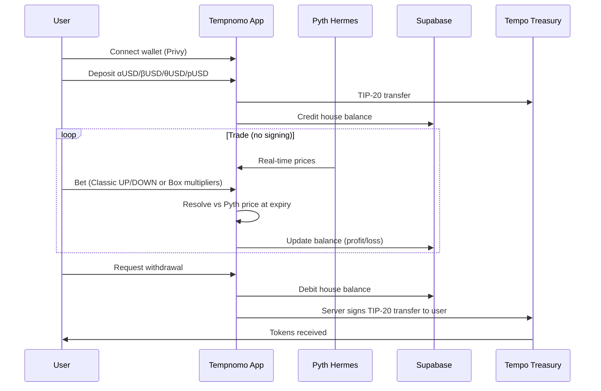
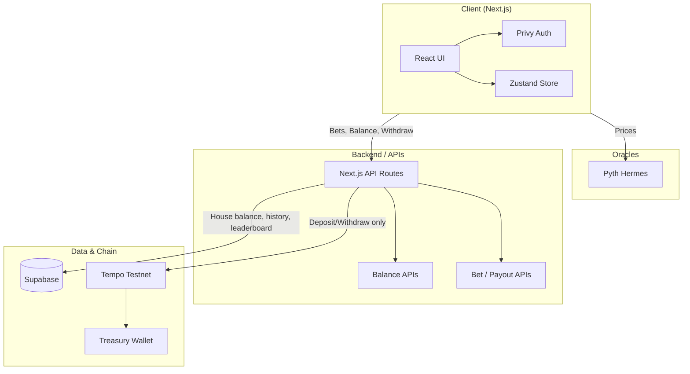
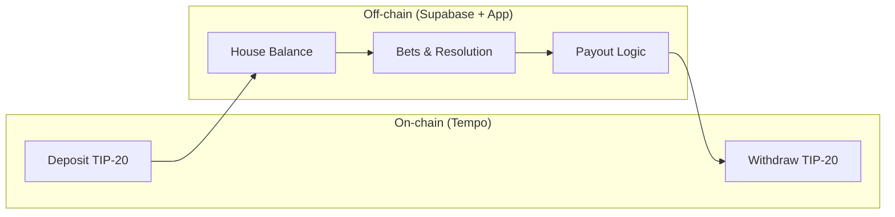
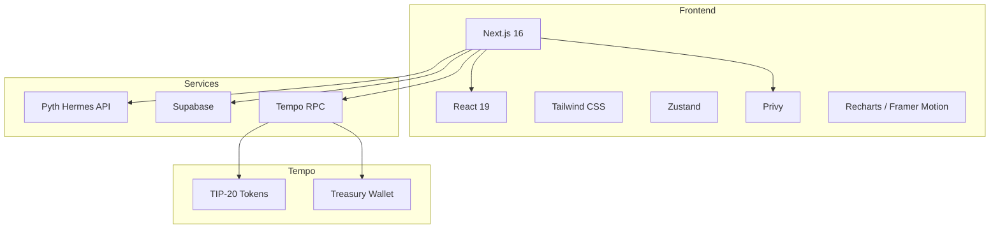

# ☂️ Tempnomo

**The first on-chain binary options trading dApp on Tempo.**

*Trade binary options with oracle-bound resolution and minimal trust.*

Powered by **Tempo** + **Pyth Hermes** price attestations + **Off-chain state (Supabase)** + x402-style payments.

---

## Why Tempnomo?

Binary options trading in Web3 barely existed. Web2 apps are often fraudulent and algorithmically biased. Real-time sub-second oracles were missing—so one news event or crash would take oracles down and break the experience for millions.

- **590M+ crypto users** and **400M+ transactions every day**
- One news / one big move / one crash → oracles crash → gap between demand and reality

**Tempnomo closes that gap:** every millisecond is tracked by Pyth oracles for real-time data. Trade 20+ Crypto, Stocks, Metals, and Forex on a live chart; bet without signing every transaction; settle in &lt;0.001 ms with a single treasury.

---

## ✨ What Tempnomo Delivers

| Capability | Description |
|------------|-------------|
| **Real-time resolution** | Pyth Hermes &lt;1s price attestations; no stale oracles |
| **Unlimited bets, no per-tx signing** | House balance model: deposit once, trade many times |
| **5s / 10s / 15s / 30s / 1m** | Binary options at multiple timeframes |
| **1–10x leverage** | Trade in open crypto markets with configurable exposure |
| **Single treasury** | One treasury for deposits and withdrawals; profit/loss netted |
| **&lt;0.001 ms settlement** | Off-chain game state + on-chain only for deposits/withdrawals |

*Like Binomo of Web2—but trust-minimized and 10× better for Web3.*

---

## How It Works



**5-step flow:**

1. **Connect & deposit** — User connects wallet (Privy), then deposits AlphaUSD, BetaUSD, ThetaUSD, or PathUSD into the app treasury.
2. **Choose mode** — **Classic**: UP/DOWN with expiry (5s–1m). **Box mode**: tap multiplier tiles; win if the live line touches the chosen tile at start.
3. **Resolution** — The passing price line (Pyth-driven) is compared to strike (Classic) or tile (Box); outcome is determined at expiry.
4. **Settlement** — Balance is updated off-chain in Supabase (profit/loss); no on-chain tx per bet.
5. **Withdrawal** — User requests withdraw; backend deducts from house balance and sends tokens from the treasury wallet to the user (on-chain).

---

## Market Opportunity

| Segment | Size / growth |
|--------|----------------|
| **Binary options / prediction** | $27.56B (2025) → ~$116B by 2034 (19.8% CAGR) |
| **Crypto prediction markets** | $45B+ annual volume (e.g. Polymarket, Kalshi) |
| **Crypto derivatives** | $86T+ annual volume (2025) |
| **Crypto users** | 590M+ worldwide |

---

## Architecture

### High-level system



### Hybrid execution model



- **On-chain:** Deposits (user → treasury), withdrawals (treasury → user). TIP-20 tokens on Tempo (Chain ID 42431).
- **Off-chain:** All betting, resolution, and balance updates via Supabase and app logic; Pyth Hermes for prices.

### Infrastructure & tech stack



---

## Competitive landscape

| Solution | Trust | Speed / UX | Cost per action | Notes |
|----------|--------|------------|------------------|-------|
| **Tempnomo** | High (Pyth Hermes + on-chain settlement) | Very fast (house balance, no per-bet signing) | Zero gas per bet; gas only on deposit/withdraw | Target: oracle-bound binary options with minimal trust and &lt;0.001 ms settlement. |
| **Polymarket / Kalshi** | High (on-chain or regulated) | Moderate (per-market resolution, slower settlement) | Higher friction per trade | Prediction markets; not sub-second binary options. |
| **Pure on-chain prediction** | High | Slow (every action on-chain) | High gas per bet | Trustworthy but expensive and slow for high-frequency binary. |
| **Web2 binary apps** | Low (opaque, often fraudulent) | Fast | N/A | Algorithmically biased; no verifiable oracle or on-chain settlement. |
| **Legacy oracle dApps** | Moderate | Slow (stale oracles, downtime) | Variable | Better than Web2 but oracles crash on volatility; not Pyth-grade real time. |

---

## Tech stack (aligned with codebase & .env)

| Layer | Technology |
|--------|------------|
| **Framework** | Next.js 16 (App Router, Turbopack) |
| **UI** | React 19, Tailwind CSS 4, Framer Motion, Recharts, d3-scale/d3-shape |
| **State** | Zustand (wallet, balance, game, history) |
| **Auth** | Privy (embedded + external wallets) |
| **Prices** | Pyth Hermes (`@pythnetwork/hermes-client`) |
| **Database** | Supabase (PostgreSQL, RLS, Service Role for admin) |
| **Chain** | Tempo Testnet (Chain ID 42431), viem, ethers |
| **Tokens** | TIP-20 (AlphaUSD, BetaUSD, ThetaUSD, PathUSD) |

### Main env vars (see `.env`)

- **Tempo:** `NEXT_PUBLIC_TEMPO_RPC_URL`, `NEXT_PUBLIC_TEMPO_CHAIN_ID`, `NEXT_PUBLIC_TREASURY_ADDRESS`, `TEMPO_TREASURY_SECRET_KEY`
- **Privy:** `NEXT_PUBLIC_PRIVY_APP_ID`, `PRIVY_APP_SECRET`
- **Supabase:** `NEXT_PUBLIC_SUPABASE_URL`, `NEXT_PUBLIC_SUPABASE_ANON_KEY`, `SUPABASE_SERVICE_ROLE_KEY`
- **App:** `NEXT_PUBLIC_APP_NAME`, `NEXT_PUBLIC_CHART_TIME_WINDOW`, etc.
- **Token addresses:** `NEXT_PUBLIC_ALPHA_USD`, `NEXT_PUBLIC_BETA_USD`, `NEXT_PUBLIC_THETA_USD`, `NEXT_PUBLIC_PATH_USD`

---

## Getting started

### Prerequisites

- Node.js 18+
- npm or yarn
- Supabase project
- Privy app (for wallet auth)

### 1. Clone and install

```bash
git clone https://github.com/AmaanSayyad/tempnomo.git
cd tempnomo
npm install
```

### 2. Environment configuration

Create a `.env` in the project root (see `.env.example` for a template). Minimum alignment with the codebase and [your `.env`](.env):

```env
# Tempo Network
NEXT_PUBLIC_TEMPO_NETWORK=testnet
NEXT_PUBLIC_TEMPO_RPC_URL=https://rpc.moderato.tempo.xyz
NEXT_PUBLIC_TEMPO_CHAIN_ID=42431
NEXT_PUBLIC_TEMPO_EXPLORER=https://explore.tempo.xyz

# Privy
NEXT_PUBLIC_PRIVY_APP_ID=your_privy_app_id
PRIVY_APP_SECRET=your_privy_app_secret

# Treasury (Tempo Testnet)
NEXT_PUBLIC_TREASURY_ADDRESS=0x...   # Treasury contract/wallet address
TEMPO_TREASURY_SECRET_KEY=0x...      # Hex, or 64-char hex, or 32-byte JSON array

# App
NEXT_PUBLIC_APP_NAME=Tempnomo
NEXT_PUBLIC_CHART_TIME_WINDOW=300000

# Tempo token addresses (testnet)
NEXT_PUBLIC_ALPHA_USD=0x20c0000000000000000000000000000000000001
NEXT_PUBLIC_BETA_USD=0x20c0000000000000000000000000000000000002
NEXT_PUBLIC_THETA_USD=0x20c0000000000000000000000000000000000003
NEXT_PUBLIC_PATH_USD=0x20c0000000000000000000000000000000000000

# Supabase
NEXT_PUBLIC_SUPABASE_URL=your_supabase_url
NEXT_PUBLIC_SUPABASE_ANON_KEY=your_anon_key
SUPABASE_SERVICE_ROLE_KEY=your_service_role_key
```

### 3. Database setup

Apply Supabase migrations (e.g. in Supabase SQL Editor or via your migration runner):

- `001_create_user_balances.sql` (or equivalent `balances` schema)
- `002_bet_history.sql`, `002_create_balance_audit_log.sql`
- `003_create_balance_procedures.sql`, `004_create_reconciliation_procedure.sql`

This creates tables/views for balances, bet history, audit log, and RLS where used.

### 4. Run the app

```bash
npm run dev
```

Open [http://localhost:3000](http://localhost:3000).

---

## Game modes

- **Classic** — Choose UP or DOWN and expiry (5s–1m). Win if price is above (UP) or below (DOWN) strike at expiry.
- **Box** — Grid of multiplier tiles. Place a bet on a tile; win if the live price line touches that tile at start. Blitz rounds apply a multiplier boost.

House balance is used for all bets; no per-bet transaction signing. Withdrawals are processed by the backend from the treasury.

---

## Future

- **Assets:** Expand to more stocks, forex, options, derivatives, futures.
- **Product:** DEX integration, more resolution types, and richer markets.
- **Goal:** Become the go-to PolyMarket-style experience for binary options—fast, oracle-backed, and on-chain where it matters (deposits/withdrawals).

---

## Contributing

1. Fork the repo.
2. Create a feature branch (`git checkout -b feature/amazing-feature`).
3. Commit changes (`git commit -m 'Add some amazing feature'`).
4. Push and open a Pull Request.